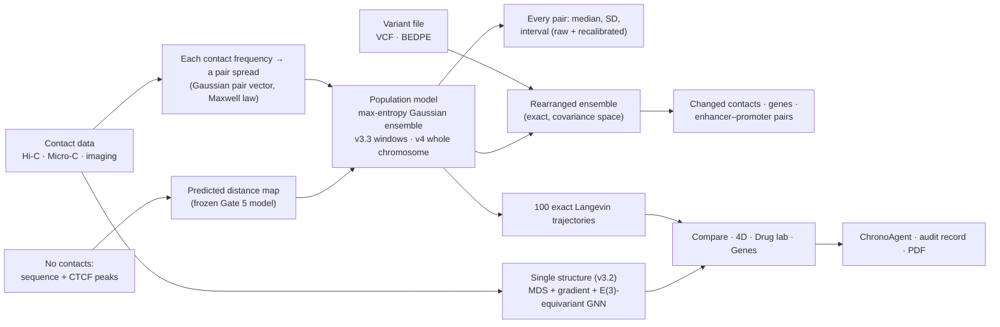

# ChronoCell-5D

**A 3D / 4D workstation for the folding of chromosomes.** It builds whole-chromosome 3D *population* models
from contact data, with an uncertainty for every distance. It goes from a structural variant to its
predicted contact changes and the genes they touch. Every claim is tested against real microscopy and
perturbation data, and the failures are reported next to the successes.


<p align="center">
  
  <br>
  <sub>The long arm of chromosome 22 (18–51 Mb) as a 3D fold, coloured from one end of the DNA to the other. Rendered from the app's built-in synthetic reference model.</sub>
</p>

---

## Contents

- [Why it matters](#why-it-matters)
- [What you can do](#what-you-can-do)
- [Quick start](#quick-start)
- [How it works](#how-it-works)
- [Accuracy: what was tested, and how it came out](#accuracy-what-was-tested-and-how-it-came-out)
- [Bring your own data](#bring-your-own-data)
- [ChronoAgent: optional AI key](#chronoagent-optional-ai-key)
- [Command line](#command-line)
- [Reproducibility](#reproducibility)
- [Project layout](#project-layout)
- [Documentation](#documentation)
- [Limitations](#limitations)
- [Licence](#licence)

---

## Why it matters

Every human cell packs about two metres of DNA into a nucleus a few micrometres across. **How that DNA is folded decides which genes can be read.** Misfolding and rearrangements are involved in cancer, cellular ageing and some neurodegenerative diseases.

The fold can't be photographed directly across a whole chromosome. Experiments such as Hi-C and Micro-C instead measure which pieces of DNA touch. ChronoCell-5D turns those measurements into 3D models, says how sure it is about each distance, and puts the tools to study the fold in one place.

## What you can do

| Page | What it does |
|---|---|
| **01 · 3D structure** | Rotate the fold, and read its size, span and activity signal. Colour it by position, activity mark, A/B compartment or TAD neighbourhood. Rebuild it from contacts as one structure (v3.2) or as a **population model**: v3.3 on windows of up to 400 beads, v4 on up to 6,000 beads, i.e. a whole human chromosome at 10 kb. Long fits show a progress bar and a Stop button. Measure the distance between any two beads, with the population's distribution and interval, and the measured coverage of that interval for your input type. **No contacts for a window?** Build the population from a prediction instead: CTCF ChIP-seq peaks of the cell type (upload, paste, or fetch from ENCODE by cell type) plus the DNA sequence, labelled *predicted* everywhere. When a window has both, the two maps are shown side by side with their agreement, never blended. Hover a bead for its locus and genes; optionally click beads or map pixels to measure. Slice the fold, show the population spread as an overlay (off by default), and export it with a reproducibility record (JSON and PDF). Two accuracy scores are shown, never mixed. **06 Analysis suite**: loops (HiCCUPS-like), boundaries and domains (insulation, TopDom-like, Arrowhead-like), compartments and P(s) from the window's contacts, exported for IGV and Juicebox (Gate 6). |
| **02 · 4D dynamics** | Play time courses, or morph Healthy → Disease → Senescent. Simulate rearrangements from presets, a custom definition or **your own VCF / BEDPE file**. *04 Variant impact* lists the changed contacts, affected genes and enhancer–promoter pairs, with 90 % intervals from refits. It is labelled with its measured standing: "mechanism simulator, not validated". Export movies and GIFs. **05 Variant impact engine v2**: rearrangements described by their breakend joins (also across two chromosomes), typed derivative chromosomes, or copy number; domain boundaries, genes (with ClinVar counts), enhancer–promoter pairs, refit intervals and a ranking across a file's variants. Still a mechanism simulator (Gate 4d blocked; the shared cohesin model passed Gate 4c). |
| **03 · Compare** | Two states side by side, with linked cameras and per-bead displacement. **Self-Math PDB State Evaluator** (new sub-tab): R_g, packing density, distance-decay exponent, gyration-tensor shape. It classifies a structure as Normal / Diseased / Senescent / Indeterminate by explicit, documented rules on a computed descriptor. It is not a diagnosis. **Differential analysis** (third sub-tab): two conditions with replicate maps (.hic, .mcool, .cool, .pairs, read by region): differential contacts with a replicate-aware test and false-discovery control, loop gain / loss, boundary changes, compartment switches (Gate 7). |
| **04 · Drug lab** | Apply an epigenetic drug mechanism (EZH2/EED, HDAC or BET inhibitor, or a loop stabiliser), drag the dose slider, and measure how far the fold moves back toward healthy. A mechanism simulator. |
| **05 · Genes** | All 19,386 human genes (hg38) or 20,995 mouse genes (mm39) placed on the fold, labelled predicted active or silenced from 3D accessibility. Shows which genes touch in 3D, and checks predictions against RNA-seq. Click a row to pick a gene; it is then marked in the 3D view. |
| **06 · Guide** | A plain-language guide to every page and number. |
| **07 · Quantum lab** | *Experimental, Research mode.* ChronoCell problems run as quantum algorithms on a **simulator on this computer** (GPU when present), always next to the classical answer: QAOA for domain walls, lattice folding, drug combinations, gene groups and variant sets; VQE for small-molecule energies; a quantum-kernel gene classifier; a quantum walk on the contact network; the swap test. Circuit diagrams, an optional hardware-noise model, OpenQASM export for real quantum computers, and a qubit-scaling chart. Each workspace also has a Quantum section. No speed-up is claimed; measured standing: Gate Q. |
| **Sidebar** | **Research mode** (on by default; off hides the mechanism simulators and the rule-based state labels), **Projects** (save and reopen a session), **Jobs** (a local queue: one GPU job at a time). |
| **🤖 ChronoAgent** | Reads the measurements on screen and writes an interpretation. Exports a Markdown report, a PDB structure and a PDF dossier. |

Genome assemblies are configuration (`chronocell/data/genomes/<assembly>/`): human hg38 and mouse mm39
ship with the app. Chromosome names are read in any common form (`chr9`, `9`, `NC_000009.12`).

<p align="center">
  
  <br>
  <sub>The Compare page idea: the same 8 Mb region in a healthy and a tumour fold, coloured by activity signal (blue low, magenta high). These are the app's synthetic demo patients.</sub>
</p>

## Quick start

```bash
git clone https://github.com/Sh1voham/ChronoCell-5D.git
cd ChronoCell-5D
pip install -r requirements.txt          # exact tested versions: requirements.lock
streamlit run app.py
```

Or with Docker (CPU): `docker build -t chronocell . && docker run --rm -p 8501:8501 chronocell`.

The app opens at <http://localhost:8501> with a clearly labelled synthetic reference chromosome.

To explore every page without data, open the sidebar and switch on **Load demo patients (synthetic)**. This adds a healthy, a tumour and a senescent chr22. They are generated locally and labelled as demo data everywhere.

PyTorch is only needed to reconstruct structures; the viewer, analytics and exports run without it.

## How it works



1. **Contacts become pair spreads.** In a Gaussian polymer, how often two pieces touch fixes the spread of their distance across cells.
2. **A population model** fits all pairs at once. It is a maximum-entropy Gaussian ensemble (the HIPPS/DIMES approach, Shi & Thirumalai 2019/2023), not one structure. The v4 parameterisation fits a whole chromosome on a CPU: low rank plus a random walk, with exact block gradients.
3. **Every distance comes with its distribution** across cells: median, SD and a central interval. The interval was tested for calibration on held-out single-cell measurements, and a recalibration fitted on practice data is shown next to it.
4. **Exact trajectories** are drawn from the ensemble (Langevin dynamics, solved exactly mode by mode). They feed the 3D view, the comparisons and the analyses.
5. **Variants** rearrange the fitted ensemble exactly in covariance space; predicted contact changes are mapped back to the reference.
6. **Without contact data**, CTCF peaks oriented by the JASPAR CTCF motif plus GC content predict each pair's median distance (a ridge model fitted on practice data, Gate 5). A population model is then fitted to that map, so every page can use it, labelled *predicted*.

Heavy reconstructions can run on a free Google Colab GPU with [`colab/ChronoCell5D_Colab.ipynb`](colab/ChronoCell5D_Colab.ipynb). Its output unzips straight into `coordinates/`.

## Accuracy: what was tested, and how it came out

Every claim was turned into a test on **real, held-out data**:
- chromatin tracing (Bintu et al., *Science* 2018; Su et al., *Cell* 2020);
- Hi-C (Rao et al., *Cell* 2014);
- a cohesin-degron experiment;
- a published cancer-genome rearrangement.

Cells are split in two halves. The model sees only contact information from one half. It is scored on distances measured in the other half, which it never saw.

Settings were chosen on separate **practice** datasets and frozen in `validation/frozen.py`. The **test** datasets were then run once. Each percentage is the share of the folding pattern recovered beyond the obvious "further along the DNA = further apart" trend, relative to how well the experiment agrees with itself.

Two scores are always kept apart:
- **contact-map fit** (agreement with the input; shows the fit converged);
- **microscopy accuracy** (agreement with unseen measurements).

The population's cell-to-cell spread is shown as *ensemble consistency*, never as accuracy.

The table below is generated from the result files by `python validation/report.py`:

<!-- BEGIN generated:readme_accuracy -->
| Test (held-out, real data) | Measured | Verdict |
|---|---|---|
| v3.3 windows, Bintu et al. 2018 tracing (3 test sets, Σ model / Σ ceiling) | population 85.6 % of the reproducible structure; v3.2 single structure 45.2 % | baseline for v4 |
| Gate 1: whole chromosome (v4) vs windows (v3.3), Su et al. 2020 chr21 + replicate, same pairs | 94.4 vs 94.4 %; 96.2 vs 96.7 %; cross-window pairs (v4 only) 89.2–93.1 % | matches within 0.5 points, slightly below |
| Gate 1b: sequencing Hi-C (Rao et al. 2014) → imaged distances, all pairs | ranks 80.4–84.7 % of the ceiling; absolute size CCC 0.22–0.33 | ranks transfer, nanometres do not |
| Gate 2: do stated 90 % intervals hold 90 % of real single-cell distances? (6 test sets) | raw 71–84 %, recalibrated on practice data 83–91 %; per-bead reliability vs error ρ -0.16 to +0.28 | raw intervals too narrow; recalibrated within 7 points of nominal; no usable per-bead reliability |
| Gate 2b: the same, with sequencing Hi-C input (4 test sets) | raw 23–51 %, recalibrated on practice Hi-C 43–73 % | fail: intervals far too narrow for Hi-C input; the app says so |
| Gate 2c: does a per-pair score from the input say which distances are wrong? | test sets reaching the pre-registered bar (ρ ≥ 0.20): imaging pair 0 of 6; imaging bead 5 of 6; Hi-C pair 0 of 4; Hi-C bead 0 of 4 | no usable reliability score |
| Gate 3: benchmark vs PASTIS 0.4.0 and baselines, imaging-derived input (28 test units) | ChronoCell 55.4–97.3 %, best PASTIS 47.4–94.2 % of the ceiling; 610 'where we lose' entries | see RESULTS.md |
| Gate 4: cohesin loss (RAD21 degron, Bintu et al. 2018), held-out region | change agreement 0.868 vs 0.336 for a trend-only shift | pass, one region |
| Gate 4b: structural variants (K562 chr9 deletions vs GM12878, Rao 2014 Hi-C) | model 0.083, distance shift 0.149, no change 0.424 | not validated (mechanism simulator) |
| Gate 5: distances from sequence + CTCF alone (no contact data) | 4 of 5 test sets pass the pre-registered rule | pass |
| Gate 1c: calibrated sizes from Hi-C (5 main sets) | CCC 0.43–0.72 after calibration (needed ≥ 0.8) | fail |
| Gate 2d: conformal distance ranges hold 85–95 % / 40–60 % in every band | imaging input 4 of 7 sets, Hi-C input 1 of 5 | imaging fail, hic fail |
| Gate 2e: per-pair reliability on untouched genome-scale sets (ρ ≥ 0.30) | su_genome · imaging +0.08; su_genome · hic +0.01; su_genome_amanitin · imaging +0.12; su_genome_amanitin · hic +0.01 | imaging fail, hic fail |
| Gate 3b: a learned correction on the population model | practice chose no correction | not run |
| Gate 4c: cohesin loss vs RAD21-degron Hi-C on 6 held-out regions | 5 of 6 regions beat trend only | pass |
| Gate 4d: SV effects on new events with Hi-C before and after | two usable events found, three needed | blocked; variant engine stays a mechanism simulator |
| Gate 5b: prediction with cohesin peaks | 0 of 5 test sets | fail |
| Gate 5m: the human predictor on mouse ES-cell tracing (4DN) | 17.0 % of the ceiling; 7.2 % of the ceiling | pass (modest) |
| Gate 6: loop calls vs ENCODE HiCCUPS calls, held-out cell lines | k562: F1 0.40 (chromosight 0.39, Mustache 0.49); imr90: F1 0.74 (chromosight 0.42, Mustache 0.47) | fail |
| Gate 7: false discoveries of the differential analysis (real replicates + planted changes) | mean FDP 0.002 at nominal 0.05; recall ×2 0.01, ×4 0.63 | pass |
<!-- END generated:readme_accuracy -->

**In plain words:**
- The whole-chromosome model reproduces the measured folding pattern as well as the windowed model, a fraction of a point below, and adds the long-range pairs.
- From sequencing Hi-C, the *ranking* of distances transfers to real cells; the absolute size in nanometres does not.
- Stated intervals were too narrow until recalibrated. For close pairs they remain somewhat too narrow; for Hi-C input, the app's usual case, they stay far too narrow even with a Hi-C-specific recalibration, and the app says so under every interval.
- No score computed from the input says reliably *which* distances are wrong: a per-pair score showed a weak signal for imaging-derived input and none for Hi-C, below the pre-registered bar, so the app shows none.
- From sequence and CTCF alone, with no contacts, a modest part of the pattern beyond the separation trend is recovered. The cohesin-depleted control scores as high, so it reflects compartments and insulation, not loops: a prior, not a measurement.
- The cohesin-loss prediction worked on its held-out region. The structural-variant simulator did **not** beat a simple genomic-distance shift on the one real rearrangement tested, so it is labelled a mechanism simulator.
- The quantum lab's algorithms do what they are designed to do on a simulator (QAOA found the optimum of real-data domain puzzles; VQE reached exact molecular energies), but its domain calls and its quantum-kernel gene classifier fell short of the classical methods on held-out data (Gate Q below). No quantum advantage is claimed.

**Quantum lab (Gate Q, simulated quantum algorithms on held-out real data):**

<!-- BEGIN generated:summary_q -->
| Test (held-out, real data; simulated quantum) | Measured | Verdict |
|---|---|---|
| Gate Q1: QAOA (simulator) finds the optimum of the domain QUBO, 66 held-out windows | 98 % of windows (needed ≥ 90 %) | pass |
| Gate Q2: quantum domain calls vs classical callers (F1 vs ENCODE Arrowhead) | k562: QAOA 0.24 vs insulation 0.35, TopDom-like 0.39; imr90: QAOA 0.27 vs insulation 0.36, TopDom-like 0.40 | fail |
| Gate Q3: VQE within chemical accuracy (H2, HeH+) | worst error 5.1e-11 mHa (needed ≤ 1.6) | pass |
| Gate Q4: quantum-kernel gene classifier vs RBF-SVM, GM12878 → IMR-90 | AUC 0.623 vs 0.657 | fail |
<!-- END generated:summary_q -->

Full record, including every failure: [`validation/RESULTS.md`](validation/RESULTS.md). How each setting was chosen: [`validation/TUNING.md`](validation/TUNING.md). Benchmark tables: [`validation/benchmark/`](validation/benchmark/).

## Bring your own data

Files are recognised **by their content**, not their name, and assigned to *Healthy*, *Disease / Cancer* or *Senescent* by words in the file or folder name. You can also upload files straight into a state from the sidebar.

| You have | Formats |
|---|---|
| 3D coordinates | `.npy` (N×3 or T×N×3), `.pdb`, `.npz`, `.xyz`, `.csv` |
| Activity / ChIP / ATAC signal | `.npy` (one value per bead), `.bedGraph`, `.bed`, `.bigWig`¹ |
| Hi-C / Micro-C contacts | `.cool`, `.mcool`, `.hic` (built-in reader, format versions 6–9), text tables (`bin bin count`, positions, BEDPE) |
| Structural variants | VCF (`SVTYPE` DEL / DUP / INV / BND, symbolic or breakend ALTs), BEDPE: in 02 · 4D dynamics |
| RNA-seq expression | `.csv` / `.tsv` (gene, value) |
| CTCF ChIP-seq peaks (prediction without contacts, hg38) | narrowPeak or BED (`.gz` accepted), pasted lines, or fetched from ENCODE by cell type (IMR-90, A549, K562, HCT116; MD5 checked): 01 · 3D structure → 03 Model & convergence → Input |

¹ needs `pyBigWig`

Put files in `coordinates/<chromosome>/` (see [`coordinates/README.md`](coordinates/README.md)) or use the sidebar and the *Data* menu. Choose the genome assembly under *Data*; another assembly can be added with `python -m chronocell.genome_fetch <assembly>`.

## ChronoAgent: optional AI key

ChronoAgent works **offline by default**: a rule-based engine answers instantly from the measurements. For free-form answers, add a free **Google AI Studio (Gemini)** or **OpenRouter** key, in either of two ways:

- **Per session:** paste it into the sidebar field **AI API Key**.
- **Permanently:** copy `.streamlit/secrets.toml.example` to `.streamlit/secrets.toml` and set `GEMINI_API_KEY` or `OPENROUTER_API_KEY`. That file is git-ignored.

The key is sent only to the provider you choose, in a request header, and is never shown on screen or written into reports.

## Command line

```bash
python -m chronocell.build_graph --fasta chr22.fa --bigwig H3K27ac.bigWig --mcool sample.mcool --out graph.npz
python -m chronocell.build_graph --synthetic --out graph.npz     # no downloads needed
python -m chronocell.train --graph graph.npz --out predicted_coords.npz
python -m chronocell.genome_fetch mm39 --species "Mus musculus" --common mouse --display GRCm39
python -m chronocell.demo_states demo_states                     # write the demo patients as files
python -m chronocell.predict --chrom chr21 --start 28000000 --end 30000000 --peaks ctcf.narrowPeak --out map.npy
                                                                 # distances from sequence + CTCF, no contacts
                                                                 # (writes map.npy + map.json: predicted, not measured)
python -m pytest                                                 # the test suite

# held-out validation (data download on demand; see validation/RESULTS.md)
python validation/validate_tracing.py                            # v3.3 windows, Bintu et al. 2018
python validation/gate1.py --test                                # whole chromosome vs windows, Hi-C -> imaging
python validation/calibration.py --test                          # interval calibration
python validation/calibration.py --test --input hic              # interval calibration with Hi-C input (Gate 2b)
python validation/reliability.py --test                          # per-pair reliability (Gate 2c)
python validation/perturbation.py --test                         # cohesin depletion
python validation/sv_validation.py                               # structural variants (K562)
python validation/predictor.py --test                            # prediction without contact data
python -m validation.benchmark.run                               # benchmark incl. PASTIS
python validation/scale_benchmark.py                             # runtime and memory vs beads (synthetic)
python validation/chromosome_runtime.py                          # runtime and memory per chromosome (synthetic)
python validation/report.py                                      # regenerate the tables in RESULTS.md / README
```

After `pip install -e .` the `chronocell` command wraps the Phase B analyses (each writes tables, BED / BEDPE /
bedGraph, Juicebox annotations, `summary.json` and a run record with input SHA-256s):

```bash
chronocell analyze map.mcool --region chr21:28000000-30000000 --res 10000 --norm kr --out out/analysis
chronocell diff --a ctrl1.hic ctrl2.hic --b treat1.hic treat2.hic --region chr21:28000000-30000000 --res 10000 --out out/diff
chronocell impact map.mcool --region chr9:130000000-131500000 --res 10000 --variants sv.vcf --refits 8 --out out/sv
chronocell batch samples.csv --out out/batch           # sample,path,region,resolution[,condition]; resumable
chronocell report out/diff --pdf                       # offline HTML (+ PDF) report with the gate standing
python -m chronocell.jobs worker                       # the local job queue (also from the app's sidebar)
python validation/cohesin_hic.py --test                # Gate 4c   (and diff_gate7.py, loops_gate6.py,
python validation/predictor_mouse.py --test            # Gate 5m    reliability_v2.py, intervals_v2.py, ...)
```

## REST API (optional)

The endpoints are plain functions in `chronocell/api.py`, and FastAPI serves them over HTTP when it is
installed:

```bash
pip install fastapi uvicorn
python -m chronocell.api --port 8000        # interactive docs at http://127.0.0.1:8000/docs
```

| Endpoint | Input | Output |
|---|---|---|
| `POST /api/v1/reconstruct` | `contacts: {i, j, count}`, `n_beads`, `model: "population"` (v3.3, ≤ 400 beads), `"population_v4"` (≤ 6,000 beads) or `"single"` | 3D coordinates, metrics, **both accuracy scores** kept separate, timings |
| `POST /api/v1/metrics` | `coords_nm` (N×3), optional `contacts` | R_g, span, ν, overlaps; contact-map fit if contacts are given |
| `GET /api/v1/benchmark` | none | the held-out microscopy benchmark |
| `POST /api/v1/analyze` | `contacts: {i, j, count, n, resolution}` | loops, boundaries, domains, summary (Gate 6 standing) |
| `POST /api/v1/diff` | `condition_a`, `condition_b`: lists of contact maps; `fdr` | significant pixels, loop / boundary / compartment changes |
| `POST /api/v1/impact` | `sources` (one or two windows) and `joins`, `segments` or `copy_number` | derivatives, top changes, genes, boundaries, E–P pairs (mechanism simulator) |

Every call is appended to a run log (`.chronocell_cache/api_run_log.jsonl`): time, endpoint, software version, parameters as sizes only, a SHA-256 of the exact input, run time and outcome.

## Reproducibility

- **Reproducibility record.** 01 · 3D structure → Export writes `chronocell_audit_log.json` and a PDF. Each holds the method, equations, parameters, dataset sources and licences, software versions, the SHA-256 of every input file and every measured metric. It is a reproducibility record, not a clinical or regulatory audit.
- **Pinned environment.** `requirements.lock` lists the exact versions the tests ran with. The `Dockerfile` builds a CPU image with the app, the tests and the validation harness. GitHub Actions (`.github/workflows/ci.yml`) runs the test suite on every push.
- **Tables.** `python validation/report.py` regenerates every numeric table in `validation/RESULTS.md` and the accuracy table in this README from the result files; the held-out tests themselves are re-run only by their own commands (above).

## Project layout

```text
ChronoCell-5D/
├── app.py                  Streamlit application (entry point)
├── chronocell/             core library, no Streamlit imports
│   ├── genome.py           assemblies as configuration (hg38, mm39), chromosomes, bands, aliases, bins
│   ├── population.py       v4 population model: whole chromosomes, per-pair uncertainty, recalibration
│   ├── ensemble.py         v3.3 population model: max-entropy ensemble + exact Langevin trajectories
│   ├── perturb.py          cohesin depletion; structural variants in covariance space; E-P pairs
│   ├── svio.py             VCF / BEDPE reading, variants -> scenarios
│   ├── predict.py          sequence + CTCF distance predictor (Gate 5), its downloads and CLI
│   ├── hicfile.py          .hic reader (v6-v9, local or remote by HTTP range)
│   ├── analytics/          pdb_evaluator.py: Self-Math PDB State Evaluator
│   ├── provenance.py       reproducibility record (JSON + PDF)
│   ├── physics.py          polymer physics: R_g, scaling, crowding, losses
│   ├── egnn.py             E(3)-equivariant GNN and single-structure fitting (v3.2)
│   ├── accuracy.py         the two separate accuracy scores and the measured evidence, read from validation/
│   ├── normalize.py        ICE contact-map balancing
│   ├── api.py              REST endpoints and run log
│   ├── synthetic.py        synthetic reference model
│   ├── features.py, formats.py, ingest.py, states.py, domains.py, genes.py
│   ├── scenarios.py        4D structural-variant animations
│   ├── therapy.py          drug-lab mechanism model
│   ├── agent.py            ChronoAgent (offline rules + Gemini / OpenRouter)
│   ├── pdf_report.py, snapshot.py, viz.py, theme.py
│   ├── genome_fetch.py     add an assembly from UCSC
│   ├── quantum/            quantum lab (experimental): statevector simulator, QAOA, VQE, quantum kernels, walks
│   └── data/               annotations (hg38, mm39), frozen calibration and perturbation parameters
├── ui/                     the six pages, sidebar and shared helpers (predict_view.py: prediction input)
│                           quantum_lab.py: 07 Quantum lab and the Quantum sections (Research mode)
├── tests/                  unit and end-to-end tests of every page
├── validation/             held-out tests, benchmark harness, tuning record, results
├── colab/                  GPU reconstruction notebook
├── coordinates/            drop-in folder for your structures
└── docs/                   plain-language overview and images
```

## Documentation

| Document | What's in it |
|---|---|
| [`docs/OVERVIEW.md`](docs/OVERVIEW.md) | The whole project in plain language, with everyday analogies |
| [`APP_GUIDE.md`](APP_GUIDE.md) | Every screen, graph, option, file and function |
| [`ARCHITECTURE.md`](ARCHITECTURE.md) | Architecture, module reference and equations |
| [`AUDIT.md`](AUDIT.md) | Audits of the code and the claims, and the corrections made |
| [`validation/RESULTS.md`](validation/RESULTS.md) | Every held-out test and its result, failures included |
| [`validation/TUNING.md`](validation/TUNING.md) | How every setting was chosen, on practice data only |
| [`coordinates/README.md`](coordinates/README.md) | Coordinate folder and file formats |
| [`UPDATES.md`](UPDATES.md) | Development log |

## Limitations

- **Research and education only.** This is not a diagnostic tool and not medical advice.
- **Absolute distances from sequencing Hi-C are not calibrated.** Ranks transfer to real cells; nanometres do not (Gate 1b).
- **Intervals are lower bounds for some inputs.** Recalibrated intervals were close to nominal for imaging-derived contacts but too narrow for close pairs (Gate 2). With sequencing Hi-C input they are far too narrow, even after a recalibration fitted on practice Hi-C (Gate 2b). There is no reliability score: neither the per-bead (Gate 2) nor the per-pair (Gate 2c) candidate reached the bar.
- **Prediction without contacts is a prior.** It recovers a modest share of the pattern on human data (Gate 5), reflects compartments and insulation rather than loops. On mouse ES-cell tracing it passed its pre-registered test, modestly (Gate 5m), and is offered for mouse with your own CTCF peaks.
- **The structural-variant simulator is not validated.** On the one real rearrangement tested it did not beat a genomic-distance shift. The v2 engine takes explicit joins (so it no longer assumes deleted intervals say how pieces are joined), but its own test with Hi-C before and after a variant could not run: two usable events were found, three are needed (Gate 4d). The cohesin-loss model it shares passed on held-out Hi-C (Gate 4c).
- **Absolute sizes from Hi-C stay uncalibrated** after a practice-fitted factor (Gate 1c), and the conformal distance ranges did not hold their coverage in every band (Gate 2d); the probe is unchanged.
- **Loop calls and differential tests have measured limits.** Loop calls agree with HiCCUPS better than chromosight and Mustache on IMR-90 but not on K562 (Gate 6, fail). The differential test keeps false discoveries far below its stated rate but, with two replicates per condition, finds most four-fold and very few two-fold changes (Gate 7). No per-pair reliability score passed (Gate 2e).
- **The drug lab is a mechanism simulator.** It shows what a drug's mechanism *could* do to a fold, not how well a drug works in patients.
- **Gene "active / silenced" labels are predictions** from 3D accessibility and signal. RNA-seq can be added to check them.
- **The PDB State Evaluator's classes are rule-based descriptors**, with thresholds stated as assumptions in `chronocell/analytics/pdb_evaluator.py`, not trained or validated disease labels.
- **GPU.** Tested on an RTX 5050 Laptop GPU (CUDA 12.8): fits agree with the CPU within a stated tolerance, and a GPU out-of-memory error refits on the CPU. The runtime tables are CPU measurements; GPU timings are not measured yet.
- **Synthetic data is labelled.** The reference model and demo patients are synthetic, and the app labels them as such everywhere.

## Licence

No licence has been chosen for this repository yet (see the open items in [`UPDATES.md`](UPDATES.md)). Until a `LICENSE` file is added, please ask the maintainers before reusing the code.

Reference data:
- GRCh38 and GRCm39 annotation and genes from the UCSC Genome Browser (RefSeq Select / MANE for human).
- Validation data are downloaded on demand and not redistributed:
  - Bintu et al., *Science* 2018 ([github.com/BogdanBintu/ChromatinImaging](https://github.com/BogdanBintu/ChromatinImaging));
  - Su et al., *Cell* 2020 (Zenodo 3928890, CC-BY-4.0);
  - Rao et al., *Cell* 2014 (GEO GSE63525);
  - ENCODE CTCF peaks (also fetched by the app on request, not redistributed);
  - UCSC hg38 sequence (fetched on request, MD5 checked);
  - JASPAR 2024 (CC BY 4.0).
- Sources, licences and checksums: `chronocell/data/validation_sources.json`, `validation/datasets.py` and `validation/data_manifest.json`.
